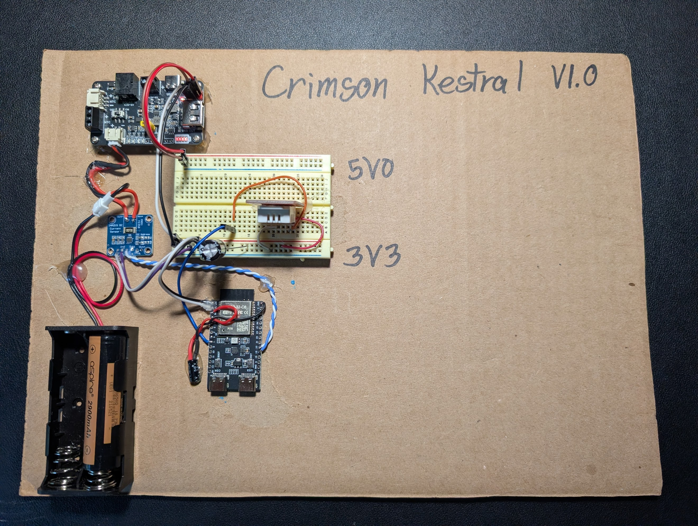

# CrimsonKestrel Phase 1 Prototype Bring-Up Guide

This guide details the step-by-step process for safely assembling, wiring, and performing the first-time hardware validation of the **CrimsonKestrel (v1.15.2)** environmental telemetry node.

<p align="center">
  
  <br>
  <em>The physical R&D cardboard-mounted bring-up bench setup</em>
</p>

Following the cardboard-mounted layout shown in your physical prototype, this guide is designed for zero-support repeatability, allowing other engineers to successfully execute the build without risk of damaging sensitive CMOS components.

---

## 🏗️ 1. Physical Bench Layout & Safety Configuration

The cardboard breadboard layout (The "Cardboard Test Bench") is a highly practical and safe prototyping strategy to prevent accidental short-circuits with stray metal tools or wires on your desk.

### Power & Ground Rails
Your board is physically separated into two distinct power zones driven by the **WatangTech Solar Charge Controller**:
1. **5.0V Rail (Top):** Powered by the WatangTech 5V USB/Terminal output. In Phase 1, this rail remains mostly inactive during deep sleep but is available to drive high-draw components or fans if expanded.
2. **3.3V Rail (Bottom):** Main system logic power rail. **All sensitive electronics (ESP32-C6, DHT22, and INA219) must run off this rail to prevent logic level mismatches or overvoltage damage**.

### Ground Plane Integrity (Star Grounding)
High-speed wireless transmissions (ESP32-C6 Wi-Fi 6 active bursts) can introduce severe high-frequency transient noise onto the power paths.
* **Rule:** Tie the ground pins of the ESP32-C6, the INA219 breakout, the DHT22 sensor, and the WatangTech battery output directly to a single shared rail on your breadboard (a **Star Ground Configuration**). This prevents ground loops and stabilizes analog sensor measurements.
* **Filter Capacitors:** Solder or insert a **$10\mu\text{F}$ to $100\mu\text{F}$ electrolytic capacitor** across the 3.3V power rail directly where it enters the breadboard to buffer transient current spikes, along with a **$0.1\mu\text{F}$ ceramic decoupling capacitor** close to the power pins of the ESP32-C6 and INA219.

---

## 🔌 2. Step-by-Step Wiring Connections

Refer to this absolute physical pin-to-pin wiring map when jumping components on your breadboard:

| Source Module Pin | Target ESP32-C6 Pin | Function | Wiring Notes |
| :--- | :--- | :--- | :--- |
| **DHT22 Pin 1 ($V_{CC}$)** | **3.3V Rail** | Sensor Power | Run directly from the common 3.3V breadboard rail. |
| **DHT22 Pin 2 (DATA)** | **GPIO1** | Single-Bus Serial | Connect directly to GPIO1 (chosen to avoid ESP32-C6 strapping-pin conflicts). |
| **DHT22 Pin 3 (NC)** | *Floating* | Not Connected | Leave disconnected. |
| **DHT22 Pin 4 (GND)** | **GND Rail** | System Ground | Connect directly to your star ground rail. |
| **INA219 VCC** | **3.3V Rail** | Chip Power | Powers the internal I2C ADC and logic gates. |
| **INA219 GND** | **GND Rail** | System Ground | Tie to your star ground rail. |
| **INA219 SDA** | **GPIO19** | I2C Data Line | Shared hardware I2C bus. |
| **INA219 SCL** | **GPIO20** | I2C Clock Line | Shared hardware I2C bus. |

### The Pull-Up Configuration Check
1. **DHT22 Data Line:** If you are using a bare 4-pin DHT22 sensor, you **must** place a physical $4.7\text{k}\Omega$ to $10\text{k}\Omega$ resistor between **Pin 1 ($V_{CC}$)** and **Pin 2 (DATA)**. If you are using a 3-pin pre-mounted breakout module, this resistor is already integrated on the module board.
2. **I2C Bus Pull-Ups:** Standard I2C requires strong physical pull-up resistors on the SCL and SDA lines to guarantee clean rise times. The internal software pull-ups on the ESP32-C6 are too weak (~$45\text{k}\Omega$) and will eventually cause communication hangs.
   * **The Hack:** Your INA219 breakout board features pre-soldered on-board $10\text{k}\Omega$ pull-up resistors. By simply wiring the INA219 directly to GPIO19 and GPIO20, the entire physical I2C bus is pulled up automatically without adding discrete resistors to your breadboard!

---

## ⚡ 3. Battery Power Path & Current Sensing (High-Side)

To accurately measure both active wireless peaks and ultra-low-power deep sleep sleep baselines, you must configure the INA219 in a **High-Side Sensing** topology:

```
[Battery V+] ──► [INA219 VIN+] ──► [0.1Ω Shunt Resistor] ──► [INA219 VIN-] ──► [To WatangTech Charger Input / Load]
```

1. Connect the **positive terminal** of your 18650 battery holder directly to the **$V_{IN+}$ terminal** of the INA219 module.
2. Connect the **$V_{IN-}$ terminal** of the INA219 module to the battery input on the **WatangTech Solar Charger Board**.
3. This configuration routes all system current directly through the on-board high-precision $0.1\Omega$ shunt resistor, allowing you to monitor active currents up to 3.2A and capture microamp sleep intervals seamlessly.
4. **Safety Check:** Ensure that the negative terminal (GND) of your battery holder is tied directly to the common ground rail of your breadboard.

---

## 💻 4. First-Time Flashing & Partition Table Setup

To write the partition map to the chip's physical registers, you must perform a specific sequence on your first USB flash:

### Arduino IDE Configurations (USB Connection)
Open the **Tools** menu in your Arduino IDE and match these parameters exactly:
* **Board:** "ESP32C6 Dev Module"
* **Flash Size:** "16MB (128Mb)"
* **Partition Scheme:** **`16M Flash (3MB APP/9.9MB FATFS)`**
* **USB CDC On Boot:** "Enabled"

### The First-Flash Sequence
1. Set **Erase All Flash Before Sketch Upload** to **`Enabled`**.
2. Plug your ESP32-C6 Core Board directly into your computer using a high-quality Type-C USB cable.
3. Select your active COM/TTY port under *Tools > Port*.
4. Click **Upload**. Enabling this setting is **required** on the first run to physically clear the factory register map and cleanly format the new 16MB partition boundaries.
5. **CRITICAL STEP:** Once the first upload completes successfully, immediately go back to *Tools > Erase All Flash Before Sketch Upload* and change it back to **`Disabled`**. 
   * *Why:* If left enabled, subsequent updates will completely wipe your local Wi-Fi profiles, non-volatile system registers (NVS), and cached local FATFS records on every upload!

---

## 🚦 5. Hardware Validation (Bring-Up Sequence)


### 🎨 WS2812 Visual Status LED Color Codes

To assist in local debugging and bring-up without having a serial monitor attached, the onboard WS2812 LED flashes standard, high-density color-coded states. Because these color codes are documented directly using GitHub-compatible hex swatches, they will render as beautifully colored visual dots directly on your GitHub landing page:

| LED State | Visual Swatch | Hex Code | R, G, B | System State & Meaning |
| :--- | :--- | :--- | :--- | :--- |
| **Solid Orange** | 🟧 ` #964B00 ` | `#964B00` | `150, 75, 0` | **System Booting:** Microcontroller powering up, establishing internal clock registers, and configuring hardware peripherals. |
| **Pulsing Yellow** | 🟨 ` #964B00 ` | `#964B00` | `150, 75, 0` (pulse) | **Wi-Fi Negotiating:** Active, non-blocking connection attempt to your local Wi-Fi gateway router. |
| **Flash Green** | 🟩 ` #009600 ` | `#009600` | `0, 150, 0` | **Publish Successful:** Environmental and system power telemetry successfully packaged and published to your MQTT broker. |
| **Solid Purple** | 🟪 ` #640064 ` | `#640064` | `100, 0, 100` | **Maintenance Window:** Active 2-second idle window listening on command topics for OTA override packages. |
| **Pulsing Cyan** | ⬜ ` #009696 ` | `#009696` | Variable | **Debug Loop Active:** Dynamic MQTT debug mode triggered; deep sleep is overridden to a rapid 5-second sampling loop. |
| **Solid Blue** | 🟦 ` #000096 ` | `#000096` | `0, 0, 150` | **OTA Mode Engaged:** Maintenance Mode active; the web-server is open and awaiting wireless firmware binaries. |
| **Pulsing Blue** | 🟦 ` #000096 ` | `#000096` | `0, 0, pulse` | **Active OTA Download:** High-speed wireless download of new compiled `.bin` firmware packets. |
| **Solid Cyan** | ⬜ ` #009696 ` | `#009696` | `0, 150, 150` | **Flash Write:** Actively committing new firmware blocks to local partition slots. |
| **Solid Green** | 🟩 ` #00FF00 ` | `#00FF00` | `0, 255, 0` | **Flash Success:** Firmware update completely written and verified; system is rebooting into the new software layer. |
| **Solid Red** | 🟥 ` #960000 ` | `#960000` | `150, 0, 0` | **System Error:** Hardware initialization failure (DHT22 missing, INA219 offline), or data sanitization outlier rejected. |
| **Fast Red Flash** | 🟥 ` #960000 ` | `#960000` | `150, 0, 0` (fast) | **Network Timeout:** Wi-Fi connection timed out or MQTT broker unreachable. Pipeline gracefully aborted to protect battery. |


Once flashed and powered up, monitor the onboard **WS2812 status LED** to verify that your hardware is initialized and communicating correctly:

```
[POWER ON] ──► SOLID ORANGE (Booting Peripherals)
                  │
                  ├──► Success? ──► PULSING YELLOW (Negotiating Wi-Fi)
                  │                    │
                  │                    ├──► Connected? ──► SOLID PURPLE (2s Listening Window)
                  │                    │                      │
                  │                    │                      └──► FLASH GREEN (Data Sent Ok!)
                  │                    │
                  │                    └──► Timeout? ──► FLASH RED & GO TO SLEEP
                  │
                  └──► INA219 Missing? ──► SOLID RED (Abort Pipeline)
```

### Expected Debug Console Log
Open your Serial Monitor set to **115200 Baud**. On power-up, you should see a clean, descriptive execution sequence:

```text
Firmware Version: 1.15.2 (Nested System, Power Stats & Secrets Include)
[SYSTEM] DHT22 initialized. Waiting 2s for sensor stabilization...
[SYSTEM] INA219 current monitor initialized successfully.
[SENSOR] DHT22 Temp: 22.4 C | Humidity: 41.2 %
[POWER] Bus Voltage: 3.95 V | Load Current: 42.1 mA
[POWER] INA219 placed in I2C Power-Down Mode (<15uA).
[WIFI] Establishing connection to <YOUR_WIFI_SSID>
......
[WIFI] Connected.
[WIFI] Node IP: <NODE_IP>
[MQTT] Subscribed to status and command topics.
[MQTT] Publishing weather package... success.
[MQTT] Publishing system package... success.
[MQTT] Nested CrimsonKestrel telemetry successfully published.
[SYSTEM] Listening for commands...
[SYSTEM] Entering deep sleep for 300 seconds.
```

If you encounter a **SOLID RED** LED on boot, immediately disconnect your power source, check for loose jumper wires on your SDA/SCL lines, and verify that the INA219 board is receiving stable 3.3V power.
