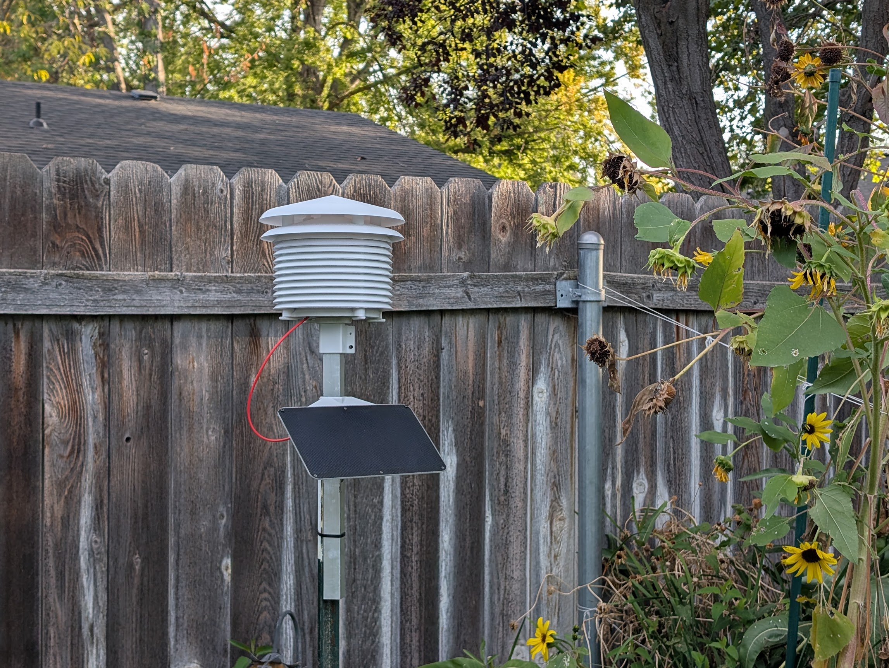

### CrimsonKestrel: Open-Source Weather & Solar Edge Node (v1.15.4)
This repository contains the reference architecture for a solar-boosted, low-power environmental monitoring station built around the **ESP32-C6 RISC-V SoC**.

Rather than a fragile "maker-grade" loop sketch, this firmware utilizes a high-reliability **Single-Shot Boot Execution Pattern** paired with robust hardware and software safety nets designed to create an incredibly reliable, "set-it-and-forget-it" testing platform.



---

#### 📑 Table of Contents
*   [System Architecture: The Hybrid Edge Pattern](#-system-architecture-the-hybrid-edge-pattern)
*   [Repository Directory Tree](#-repository-directory-tree)
*   [Getting Started](#-getting-started)
*   [Standalone Sourcing and Documentation Assets](#-standalone-sourcing-and-documentation-assets)

---

#### 🏗 System Architecture: The Hybrid Edge Pattern
To show quality design decisions while keeping the build highly accessible for makers, the system is architected as an overly robust, modular R&D platform. Instead of a single rigid design, this approach supports a wide range of interchangeable sensors for testing, availability, and budget. This allows anyone from any environment to build a simple, low-cost weather station using parts they already have or can easily afford, while separating physical environmental data collection from heavy data processing:

```
[ Outdoor ESP32-C6 Node ] 
       │ 
       │  (1. Single-Shot Boot: Sample -> Connect -> Decoupled JSON Payloads -> Deep Sleep)
       ▼ 
[ Indoor Gateway (Raspberry Pi @ <GATEWAY_IP>) ]
       │
       ├──► [ MQTT Broker (Mosquitto) ]
       ├──► [ Time-Series Database (InfluxDB) ]
       └──► [ Visualization Dashboard (Grafana) ]
```

*   **The Edge Node:** Wakes up from hardware deep sleep, takes rapid, averaged sensor samples, negotiates Wi-Fi/MQTT sockets, fires decoupled, nested JSON payloads, and drops back into deep sleep.
*   **The Gateway:** Lives indoors on permanent wall power. It handles heavy networking, data storage, third-party weather aggregator API pushing (such as Weather Underground, CWOP, or Home Assistant), and visualization dashboards.

---

#### 📂 Repository Directory Tree
A clean, decoupled directory structure immediately communicates professional maturity:
```
CrimsonKestrel-edge/
├── .gitignore                      <-- Publicly ignores secrets.h
├── LICENSE                         <-- MIT License
├── README.md                       <-- This document
├── BOM.md                          <-- Standalone Bill of Materials & Sourcing Guide
├── BRINGUP.md                      <-- Prototype Assembly & First-Time Bring-Up Guide
├── docs/
│   ├── SETUP.md                    <-- Arduino flashing config & gateway/Docker/Grafana walkthrough
│   ├── REFERENCE.md                <-- Firmware safeguards, LED codes, credentials pattern, JSON schemas
│   ├── images/
│   │   ├── crimson_kestrel_banner.png
│   │   ├── crimson_kestrel_logo.png
│   │   ├── prototype.jpg           <-- Real-world cardboard-mounted prototype photo
│   │   └── crimson_kestrel_v1.0_deployment.jpg <-- v1.0 node deployed in the field
│   ├── adr/
│   │   ├── adr-0001-hybrid-edge.md
│   │   ├── adr-0002-device-observability.md
│   │   ├── adr-0003-decoupled-schemas.md
│   │   └── adr-0004-framework-selection.md
│   └── postmortems/
│       └── mdns-underscore-bug.md  <-- OTA/mDNS underscore bootloop bug write-up
└── firmware/
    └── CrimsonKestrel/
        ├── CrimsonKestrel.ino      <-- Rebranded and updated v1.15.4 Arduino source code
        ├── secrets.h               <-- Private local Wi-Fi and MQTT credentials
        └── secrets.example.h       <-- Public configuration template
└── gateway/
    └── crimson_kestrel_daemon.py   <-- Paho-MQTT gateway subscriber & log rotator
```

---

#### 🚀 Getting Started
*   **Building the hardware:** [BOM.md](BOM.md) (parts/sourcing) and [BRINGUP.md](BRINGUP.md) (assembly and first flash).
*   **Flashing firmware & standing up the gateway stack:** [docs/SETUP.md](docs/SETUP.md).
*   **Firmware safeguards, LED codes, credentials pattern, and JSON telemetry schemas:** [docs/REFERENCE.md](docs/REFERENCE.md).
*   **Design rationale:** [docs/adr/](docs/adr/) — Architectural Decision Records covering the hybrid edge split, device observability, telemetry schemas, and framework selection.
*   **Post-mortems:** [docs/postmortems/mdns-underscore-bug.md](docs/postmortems/mdns-underscore-bug.md) — the mDNS underscore/OTA bootloop bug and its fix.

---

#### 🛠️ Standalone Sourcing and Documentation Assets
To keep the repository clean and avoid support overhead, we maintain detailed, standalone documents for hardware assembly and components:
*   **BOM.md**: Complete, itemized Bill of Materials with pricing, manufacturer part numbers, sourcing links, and direct-solder wiring maps.
*   **BRINGUP.md**: Prototype Assembly & First-Time Flashing Guide detailing physical breadboard layout, star grounding, sensor pull-ups, and step-by-step firmware installation.
*   **docs/SETUP.md**: Arduino IDE flashing configuration and the full gateway/Docker/Grafana setup walkthrough.
*   **docs/REFERENCE.md**: Firmware safeguards, WS2812 LED color codes, the credentials abstraction pattern, and the JSON telemetry schemas.
*   **gateway/crimson_kestrel_daemon.py**: Production-grade Python ingestion daemon that subscribes to raw MQTT streams, validates payload metrics, and commits structured outputs to rolling daily logs.
*   **docs/images/prototype.jpg**: High-resolution photo of our card-mounted rapid prototyping bench used to validate logic states and bus connections during development.
*   **docs/images/crimson_kestrel_v1.0_deployment.jpg**: Photo of the v1.0 node deployed in the field (backyard), shown near the top of this README.
*   **docs/adr/**: Formal Architectural Decision Records (ADRs) documenting core design decisions:
    *   **ADR-0001: The Hybrid Edge Architecture**: Moving heavy processing indoors to achieve a microamp sleep baseline outdoors.
    *   **ADR-0002: Hardware-Based Device Observability**: Opting for register-gated I2C power monitoring over power-bleeding resistive dividers.
    *   **ADR-0003: Decoupled Multi-Topic Telemetry Schemas**: Separating ambient environmental metrics from transient system diagnostics.
    *   **ADR-0004: Development Framework Selection**: Selecting the Arduino ESP32 Core over ESP-IDF or Zephyr RTOS for rapid prototyping and accessibility.
*   **docs/postmortems/**: Write-ups of notable field/integration bugs and their root causes:
    *   **mdns-underscore-bug.md**: The RFC 1035 hostname violation that caused an OTA-triggered crash-on-boot loop.
